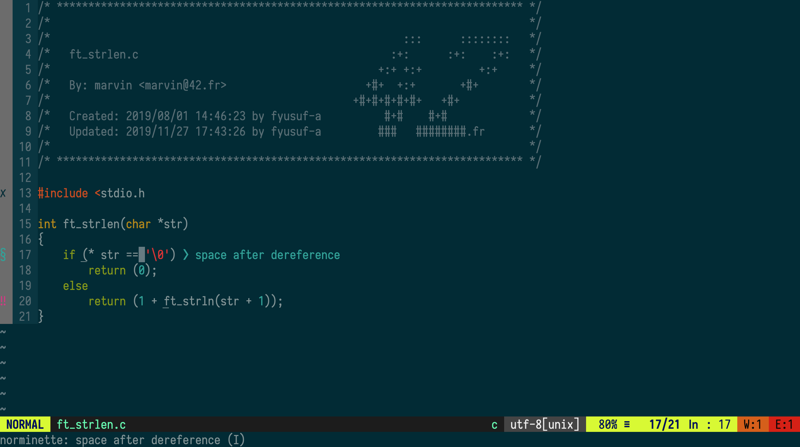

cfor42
======

Introduction
------------

This small package enables you to add syntax checks in margin in (neo)vim and a nice package for putting your 42 header on top of your file.
Do not forget to edit the MAIL environment variable for the :Stdheader command to work.
This package requires the norminette command to work (basically you need to be inside a 42 building to get norm errors).



Installation
------------

Below are just some of the methods for installing cfor42. Do not follow all of these instructions; just pick your favorite one. Other plugin managers exist, and cfor42 should install just fine with any of them.

#### [vim-plug](https://github.com/junegunn/vim-plug)
```vim
call plug#begin()
Plug 'fyusuf-a/cfor42'
Plug 'neomake/neomake'
Plug 'pbondoer/vim-42header'
call plug#end()
```

And then call `:PlugInstall`

#### Vim 8+ packages

If you are using VIM version 8 or higher you can use its built-in package management; see `:help packages` for more information. Just run these commands in your terminal:

```bash
git clone https://github.com/fyusuf-a/cfor42 ~/.vim/pack/vendor/start/cfor42
git clone https://github.com/neomake/neomake ~/.vim/pack/vendor/start/neomake
git clone https://github.com/pbondoer/vim-42header ~/.vim/pack/vendor/start/vim-42header
vim -u NONE -c "helptags ~/.vim/pack/vendor/start/neomake/doc" -c q
```

Otherwise, these are some of the several 3rd-party plugin managers you can choose from. Be sure you read the instructions for your chosen plugin, as there typically are additional steps you need to take.

#### [pathogen.vim](https://github.com/tpope/vim-pathogen)

In the terminal,
```bash
git clone https://github.com/fyusuf-a/cfor42.git ~/.vim/bundle/cfor42
git clone https://github.com/neomake/neomake ~/.vim/bundle/neomake
git clone https://github.com/pbondoer/vim-42header.git ~/.vim/bundle/vim42-header
```
In your vimrc,
```vim
call pathogen#infect()
```

Then reload vim, run `:Helptags`.

#### [Vundle.vim](https://github.com/VundleVim/Vundle.vim)
```vim
call vundle#begin()
Plugin 'fyusuf-a/cfor42'
Plugin 'neomake/neomake'
Plugin 'pbondoer/vim-42header'
call vundle#end()
```

#### [apt-vim](https://github.com/egalpin/apt-vim)
```bash
apt-vim install -y https://github.com/fyusuf-a/cfor42.git
apt-vim install -y https://github.com/neomake/neomake.git
apt-vim install -y https://github.com/pbondoer/vim-42header.git
```

F.A.Q.
------

#### I am not seeing errors from norminette like `global scope bad aligned', what can I do?

Those types of errors come without line number, so neomake cannot put a sign in the margin. You can show those errors by adding the following line to your .vimrc:

```vim
let g:neomake_open_list=1
```

Or, if you only want this behaviour for C files:

```vim
autocmd filetype c let b:neomake_open_list=1
```

---
#### Vim is too slow since I installed this plugin, how can I work it out?

Choose one of the following configs.
```vim
" When writing a buffer (no delay).
call neomake#configure#automake('w')

" When writing a buffer (no delay), and on normal mode changes (after 750ms).
call neomake#configure#automake('nw', 750)

" When reading a buffer (after 1s), and when writing (no delay).
call neomake#configure#automake('rw', 1000)
```

---
#### How can I change default signs in margin?

Use these variables in your vimrc.
```vim
let g:neomake_error_sign = {
	\ 'text': "✗",
	\ 'texthl': 'NeomakeErrorSign'
	\ }

let g:neomake_warning_sign = {
	\ 'text': "‼",
	\ 'texthl': 'NeomakeWarningSign'
	\ }

let g:neomake_info_sign = {
	\ 'text': '§',
	\ 'texthl': 'NeomakeInfoSign'
	\ }
```
